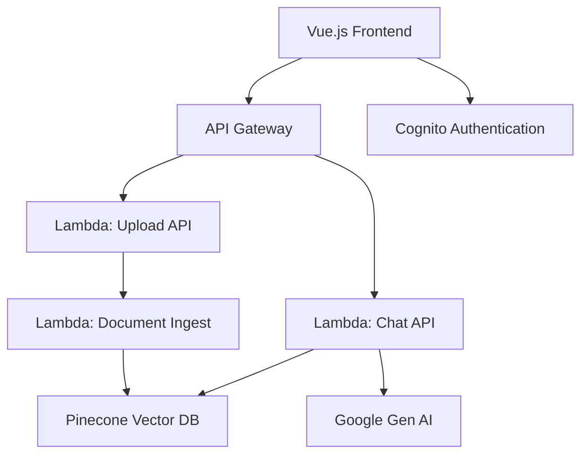

# DocuMentor AI

A document chat assistant that lets you upload documents and ask questions about their content. Built with RAG (Retrieval-Augmented Generation) to provide accurate, contextual responses from your uploaded files.

## Features

- **Document Upload & Processing** - Supports PDF uploads with automatic text extraction and indexing
- **Chat Interface** - Ask questions and get answers based on document content
- **User Authentication** - Secure login system using AWS Cognito
- **Vector Search** - Uses Pinecone for semantic document search
- **Serverless Backend** - Built on AWS Lambda for scalability
- **Modern Frontend** - Vue.js web interface

## Tech Stack

### Frontend
- **Vue.js 3** - Web framework
- **Vite** - Build tool and dev server
- **JavaScript ES6+**

### Backend
- **Python 3.12** - Core backend
- **AWS Lambda** - Serverless functions
- **AWS Cognito** - User authentication
- **Pinecone** - Vector database for document search
- **Google Gen AI** - Language model for responses

### Infrastructure
- **SST** - Infrastructure as code
- **AWS** - Cloud platform
- **Lambda URLs** - HTTP endpoints

## Getting Started

### Prerequisites
- Node.js 18+
- Python 3.12+
- AWS Account
- Pinecone Account

### Installation
```bash
git clone https://github.com/yourusername/documentor-ai.git
cd documentor-ai

# Install backend dependencies
python -m venv .venv
source .venv/bin/activate  # On Windows: .venv\Scripts\activate
pip install -r src/requirements.txt

# Install frontend dependencies
cd frontend
npm install
```

### Environment Setup

#### Backend (Root directory)
Create `.env` file:
```bash
# AWS Configuration
COGNITO_REGION=us-east-1
COGNITO_USER_POOL_ID=your_user_pool_id
COGNITO_CLIENT_ID=your_client_id

# Pinecone Configuration
PINECONE_API_KEY=your_pinecone_api_key
PINECONE_INDEX_NAME=your_index_name

# Google AI Configuration
GOOGLE_API_KEY=your_google_ai_api_key
```

#### Frontend
Create `frontend/.env` file:
```bash
# API Endpoints (will be populated after deployment)
VITE_CHAT_API_URL=your_chat_lambda_url
VITE_UPLOAD_API_URL=your_upload_lambda_url
```

### Deploy Infrastructure
```bash
# Deploy AWS resources
npx sst deploy

# Note the Lambda URLs from deployment output
# Update frontend/.env with the URLs
```

### Run Development Server
```bash
# Start frontend development server
cd frontend
npm run dev
```

## Project Structure

```
documentor-ai/
├── frontend/           # Vue.js web application
│   ├── src/
│   │   ├── App.vue       # Main application component
│   │   └── main.js       # Application entry point
│   └── package.json      # Frontend dependencies
├── src/               # Python Lambda functions
│   ├── auth.py           # Cognito authentication
│   ├── chat.py           # Chat API endpoint
│   ├── upload.py         # Document upload handler
│   ├── ingest.py         # Document processing & indexing
│   └── rag.py            # RAG implementation
├── documentation/     # Technical documentation
├── sst.config.ts         # Infrastructure configuration
└── README.md            # This file
```

## Configuration

### AWS Services Setup
1. **Cognito User Pool** - Create user pool for authentication
2. **Lambda Functions** - Deployed automatically via SST
3. **IAM Roles** - Configured for Lambda execution

### Pinecone Setup
1. Create a new index with 1536 dimensions
2. Use cosine similarity metric
3. Note your API key and index name

### Google AI Setup
1. Get API key from Google AI Studio
2. Enable required AI models

## Deployment

### Production Deployment
```bash
# Deploy to production stage
npx sst deploy --stage production

# Update production environment variables
# Deploy frontend to your hosting service
cd frontend
npm run build
```

### Environment Stages
- `dev` - Development environment
- `staging` - Staging environment  
- `production` - Production environment

## Architecture



## API Documentation

### Chat Endpoint
```bash
POST /chat
{
  "message": "What is this document about?",
  "sessionId": "session-123"
}
```

### Upload Endpoint
```bash
POST /upload
{
  "file": "base64-encoded-file",
  "filename": "document.pdf"
}
```

## Contributing

1. Fork the repository
2. Create a feature branch (`git checkout -b feature/new-feature`)
3. Commit your changes (`git commit -m 'Add new feature'`)
4. Push to the branch (`git push origin feature/new-feature`)
5. Open a Pull Request

## License

This project is licensed under the MIT License - see the [LICENSE](LICENSE) file for details.

## Support

- **Email**: your-email@example.com
- **Issues**: [GitHub Issues](https://github.com/yourusername/documentor-ai/issues)
- **Documentation**: See `/documentation` folder

## Version

Current version: **1.0.0**

---

